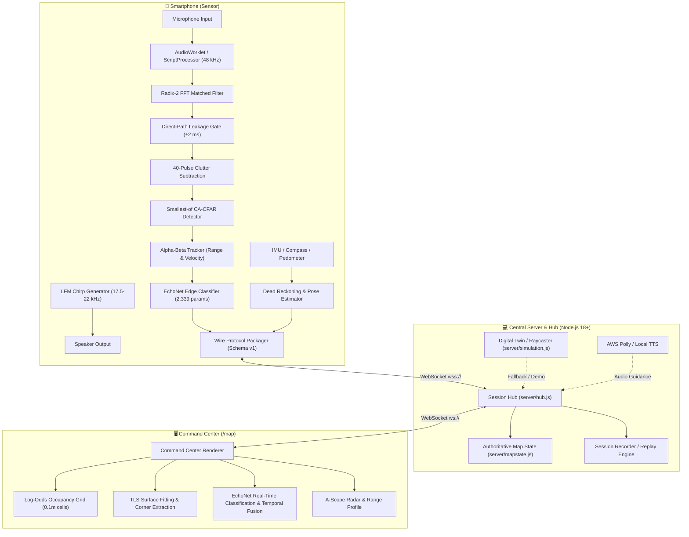

# 🦇 SentryShield

> **Acoustic perception and live spatial mapping from a smartphone.**  
> Emits near-ultrasonic chirps, detects millimeter-scale echo returns on-device, classifies surfaces using a lightweight edge neural network, and fuses the stream into a real-time occupancy map — seeing through smoke, dust, and total darkness using sound rather than light.

[]()
[]()
[]()
[]()

---

## 📑 Table of Contents

- [Overview](#-overview)
- [System Architecture](#-system-architecture)
- [Quick Start](#-quick-start)
- [👥 Team Field-Guide: Multi-Phone Real Data Collection & Retraining](#-team-field-guide-multi-phone-real-data-collection--retraining)
- [Team Guide: Calibration & Tuning Accuracy](#-team-guide-calibration--tuning-accuracy)
  - [1. Mobile Calibration Workflow](#1-mobile-calibration-workflow)
  - [2. Tuning DSP & Range Detection](#2-tuning-dsp--range-detection)
  - [3. Improving Surface Reconstruction Accuracy](#3-improving-surface-reconstruction-accuracy)
  - [4. Retraining & Tuning the EchoNet Classifier](#4-retraining--tuning-the-echonet-classifier)
- [Hardware & Diagnostics Guide](#-hardware--diagnostics-guide)
- [Demonstration & Operational Modes](#-demonstration--operational-modes)
- [Benchmarked Metrics (Measured, Not Claimed)](#-benchmarked-metrics-measured-not-claimed)
- [Repository Structure](#-repository-structure)
- [Testing & Evaluation Commands](#-testing--evaluation-commands)
- [AWS Cloud Integration (Optional)](#-aws-cloud-integration-optional)
- [Documentation Directory](#-documentation-directory)

---

## 🔭 Overview

In low-visibility tactical or search-and-rescue situations (thick smoke, total blackout, dense dust), optical cameras and LiDAR are blind. **SentryShield** turns any standard smartphone into an active acoustic radar:

1. **Emission:** Phone speaker transmits near-ultrasonic linear frequency modulated (LFM) chirps (17.5 kHz → 22 kHz, 15 ms duration, Hann-windowed).
2. **On-Device DSP:** Phone microphone captures raw audio; an analytic matched filter computes the pulse envelope, removes clutter across 40 pulses, and runs Cell-Averaging CFAR (Constant False Alarm Rate) detection to lock targets with sub-5 cm accuracy.
3. **Edge Neural Classification (EchoNet):** A compact 2,339-parameter neural network classifies each return window into `WALL`, `SOFT` (curtains/furniture), or `OPENING` (doorways/voids).
4. **Spatial Fusion & Mapping:** Detections are streamed via WebSockets to a command center, updating a Bayesian log-odds occupancy grid and running Total Least Squares (TLS) surface reconstruction to fit walls, detect corners, and outline rooms.

---

## 🏗 System Architecture



---

## 🚀 Quick Start

### Prerequisites
- **Node.js**: Version 18+ (tested on Node 22).
- **Zero build step**: Pure Vanilla ES modules. No Webpack, Vite, or bundle headaches.

### 1. Install & Run
```bash
git clone https://github.com/prorm/first-commit-.git
cd first-commit-
npm install
npm start
```

The terminal will print:
```text
================================================================
  SENTRYSHIELD READY        acoustic perception prototype
================================================================
  COMMAND CENTER   http://localhost:8000/map
  PHONE SENSOR     https://<YOUR-LAN-IP>:8443/phone
  DIAGNOSTICS      https://<YOUR-LAN-IP>:8443/diagnostics
```

### 2. Open Command Center
Open **`http://localhost:8000/map`** on your laptop.
- **`M`** — Start/Stop mission scan.
- **`Z`** — Toggle Zero-Visibility mode (simulates total blackout / acoustic-only view).
- **`R`** — Trigger surface reconstruction (fits point cloud to boundary lines).
- **`P`** — Replay last recorded mission.
- **`F`** — Fit view to room bounds.
- **`C`** — Re-center on sensor.

---

## 👥 Team Field-Guide: Multi-Phone Real Data Collection & Retraining

> **Tonight's Mission for the Team of 4:** Collect as many physical acoustic pulse signatures as possible across all your devices (**OnePlus Nord / series, Redmi Note 13, Motorola**), pool them into the central repository, and train EchoNet on physical acoustics.

### 📱 1. Phone Hardware Orientation & Positioning

Different phones have different microphone and speaker placements. For acoustic radar, the speaker transmits near-ultrasonic chirps (17.5–22 kHz) and the microphone captures the physical reflection:

| Phone Model | Speaker Location | Microphone Location | Correct Orientation |
|:---|:---|:---|:---|
| **OnePlus (Nord / 5 / CE / etc)** | Bottom edge | Bottom edge (pinhole next to USB-C) | **Point the bottom edge directly at the obstacle / target.** |
| **Redmi Note 13** | Bottom + top earpiece | Bottom edge primary mic (+ top noise mic) | **Point bottom edge forward.** Hold by sides. |
| **Motorola (Moto G / Edge)** | Bottom edge | Bottom edge primary mic | **Point bottom edge directly at target.** |

#### ⚠️ Critical Rules for Clean Acoustics:
1. **DO NOT BLOCK THE MIC PINHOLE**: Hold the phone by its long side edges or top edge. If your palm or finger covers the bottom microphone hole, the echo SNR drops to zero.
2. **MEDIA VOLUME**: Set media volume to **70% – 80%**. Do *not* max out to 100% (phone amplifiers distort at maximum gain, producing harmonic distortion).
3. **AUDIO / VOICE GUIDANCE**: Kept **OFF by default** in the phone app so speech synthesis does not leak into the microphone while listening for echo chirps.

---

### 📋 2. Step-by-Step Data Collection Protocol

1. **Connect Phone to Laptop:**
   - Connect phone to the same Wi-Fi as your laptop.
   - Start server on laptop: `npm start`
   - On phone browser (Chrome/Brave), open: `http://<laptop-ip>:3000/phone` (or scan the QR code on the laptop screen).
2. **Open the Collector:**
   - Tap **🎯 RECORD TRAINING DATASET** at the bottom of the screen.
3. **Select Your Device & Target Count:**
   - Choose your phone model from the **Device** dropdown (*OnePlus Nord*, *Redmi Note 13*, *Motorola*, etc.).
   - Choose **Pulses per class**: select **100** or **200** pulses. (At 20 chirps/sec, 200 pulses takes only **~10–15 seconds**!).
4. **Step 1: WALL (Class 0)**
   - Aim the phone bottom edge at a solid wall (plaster, drywall, wooden door, brick, or glass).
   - **Pro-Tip for Diversity:** Tap **START RECORDING** and **slowly walk backward and forward between 0.5 m and 3.0 m** while the counter climbs! This trains the model to recognize walls at all distances.
   - Chime sounds when complete. Tap **NEXT: SOFT / HUMAN →**.
5. **Step 2: SOFT / HUMAN (Class 1)**
   - Have a teammate stand in front of the phone, or aim at a couch, mattress, heavy curtains, or winter jacket.
   - Tap **START RECORDING** and record at **1.0 m, 1.8 m, and 2.5 m**. Have your teammate face forward and sideways.
   - Chime sounds when complete. Tap **NEXT: OPENING →**.
6. **Step 3: OPENING / VOID (Class 2)**
   - Aim down the center of an open hallway, down a stairwell, or through an open doorway into an empty room (>3.5 m to any object).
   - Tap **START RECORDING** and hold steady for 10 seconds.
   - Chime sounds when complete. Tap **NEXT: REVIEW & SAVE →**.
7. **Step 4: SAVE TO LAPTOP SERVER**
   - Verify the summary shows your counts (e.g., 200 Wall, 200 Soft, 200 Opening = 600 pulses).
   - Tap **💾 SAVE TO LAPTOP SERVER**.
   - The file is automatically saved into the `recordings/` folder as `real_echo_dataset_<timestamp>.json` with your phone's model name!

---

### 🚀 3. Multi-Phone Automatic Dataset Pooling & Training

You do **not** need to manually merge JSON files! Every time any team member saves a dataset from their phone, `server/hub.js` saves a unique timestamped file in `recordings/`.

The trainer script **automatically discovers and pools all files matching `recordings/real_*.json`**, deduplicating any repeated pulses:

#### Run the Trainer:
```bash
# 1. Standard Calibrated Training (Pulls all real phone recordings):
npm run train-real

# 2. Pure Real Hardware Training (100% real phone acoustic signatures, zero synthetic data):
node scripts/train-real.mjs --pure-real
```

The trainer will print:
- List of all dataset files discovered and pulse count per device.
- Class breakdown (e.g. 500 Wall, 500 Soft, 500 Opening).
- Confusion matrix on your phones' actual hardware acoustics.
- Automatically exports the calibrated weights to `src/classifier/echonet_weights.js` and `public/vendor/echonet_weights.js`.

---

### 🧪 4. Verifying Model Accuracy
After running the trainer:
```bash
# Run unit & spatial pipeline tests:
npm test

# Benchmark classifier metrics:
node scripts/verify-classifier.mjs 100
```

---

## 🎯 Team Guide: Calibration & Tuning Accuracy

This section is specifically for team members working on physical testing, acoustic calibration, and refining classification/reconstruction accuracy.

### 1. Mobile Calibration Workflow

Audio hardware on phones introduces variable I/O latency, physical speaker-to-mic distance offsets, and speed-of-sound discrepancies due to ambient room temperature.

**Calibration Steps on Device (`/phone`):**
1. Connect the phone to the server via Wi-Fi (`https://<YOUR-LAN-IP>:8443/phone`).
2. Accept the self-signed HTTPS certificate (*Advanced → Proceed*).
3. Tap **ENABLE SENSORS**.
4. Stand facing a flat, rigid wall with a tape measure:
   - Measure exactly **1.0 m** (or 0.5 m / 1.5 m) from the phone's top edge to the wall.
   - Ensure no other obstacles are within ±30° of the phone boresight.
5. Tap **CALIBRATE** in the mobile UI:
   - Select your measured distance (e.g., `1.0 m`).
   - Tap **COLLECT SAMPLES** and hold still for ~20 pulses (about 1 second).
6. **Evaluate the Calibration Quality:**
   - **Accepted:** Sample spread is $< 8\text{ cm}$. A scaling factor is calculated and stored in `sessionStorage`. The badge displays **`CAL: ACTIVE`**.
   - **Poor Spread ($> 8\text{ cm}$):** Indicates acoustic reflections or multipath interference. Move to a clearer wall and repeat.

---

### 2. Tuning DSP & Range Detection

All on-device signal processing parameters live in [`public/phone/dsp/pipeline.mjs`](public/phone/dsp/pipeline.mjs):

| Parameter | Location | Description & Tuning Guidance |
|---|---|---|
| `DIRECT_PATH_GATE_MS` | `pipeline.mjs` | Suppresses speaker-to-mic direct transmission bleed (default: ±2 ms / ~0.34 m). Decrease slightly if near-field blind zone must be shortened; increase if direct-path leakage triggers false alarms. |
| `CLUTTER_ALPHA` | `pipeline.mjs` | Multi-pulse clutter subtraction smoothing factor (default: 40 pulses). Higher values adapt faster to dynamic scenes; lower values preserve weak stationary echoes. |
| `CFAR_GUARD_CELLS` & `CFAR_REF_CELLS` | `pipeline.mjs` | Cell-Averaging CFAR window sizing. Adjust when testing in reverberant or narrow spaces. |
| `CFAR_THRESHOLD_FACTOR` | `pipeline.mjs` | Margin over estimated noise floor. If observing false alarms in quiet rooms, increase margin. If missing echoes from soft surfaces, reduce slightly. |
| `TRACKER_ALPHA` / `BETA` | `pipeline.mjs` | Alpha-beta tracker filter gains for range and velocity tracking. Controls how aggressively target jumps are smoothed. |

Validate your DSP modifications with:
```bash
npm test
```

---

### 3. Improving Surface Reconstruction Accuracy

Surface extraction logic resides in [`public/shared/reconstruct.mjs`](public/shared/reconstruct.mjs):

1. **Cluster Splitting:** Points are grouped by proximity, then split recursively using Total Least Squares (TLS). If walls show "phantom diagonal bridges", adjust `SPLIT_DISTANCE_THRESHOLD` and along-axis gap limits.
2. **Doorway / Opening Candidates:** Openings are proposed where raycasts clear free space between boundary segments. To calibrate opening candidate confidence, tune the gap detection thresholds in `detectOpenings()`.
3. **Benchmarking Surface Accuracy:** Run the evaluation script against ground truth:
   ```bash
   node scripts/eval-reconstruction.js
   ```

---

### 4. Retraining & Tuning the EchoNet Classifier

EchoNet is a 1D convolutional / dense network classifying 64-sample echo envelope windows into:
- `0`: **WALL** (specular hard reflector)
- `1`: **SOFT** (diffuse/absorptive surface: cloth, curtain, upholstery)
- `2`: **OPENING** (corridor, open doorway, deep dropoff)

The training and data generation scripts live in [`src/classifier/`](src/classifier/):
- **Generate dataset:** `python src/classifier/generate_echonet_dataset.py`
- **Train model:** `python src/classifier/train_echonet.py`
- **Model weights:** Exported directly to JSON/ESM weights loaded by `public/shared/echosynth.mjs` and the phone pipeline.

**Evaluate Classifier Metrics:**
```bash
node scripts/verify-classifier.mjs
node scripts/window-stats.mjs
```

> **Note on Classification Honesty:** In synthetic validation, EchoNet scores **91% on WALL**, **74% on SOFT**, and **43% on OPENING** (69.5% overall). Openings are inherently harder due to wide-beam diffraction. Because of this, the UI intentionally tags openings as `OPENING?` with capped confidence rather than overpromising.

---

## 📱 Hardware & Diagnostics Guide

Before conducting live acoustic runs on a physical device (e.g., OnePlus 12R), open the hardware diagnostics page:
👉 **`https://<YOUR-LAN-IP>:8443/diagnostics`**

| Diagnostic Test | What It Verifies | Troubleshooting / Action |
|---|---|---|
| **RUN SELF TEST** | Executes 26 offline tests of DSP, projection, occupancy, and wire protocol. | Runs purely in JS; must pass 100% on any browser. |
| **TEST CHIRP** | Emits 17.5–22 kHz sweep to verify hardware speaker frequency response. | Turn volume up to ~80%. If inaudible/distorted, check phone speaker roll-off. |
| **TEST MICROPHONE** | Verifies `getUserMedia` grants raw access without AGC or noise cancellation. | Ensure Chrome does not force system noise reduction, which clips ultrasonic signals. |
| **TEST ORIENTATION** | Tests gyroscope, compass magnetometer, and pedometer step events. | If `absolute` flag is false, compass requires manual zeroing in UI. |
| **TEST WEBSOCKET** | Tests two-way packet throughput and error handling over LAN. | Check that laptop and phone are on the same subnet without AP isolation. |
| **TEST FULL LOOP** | Full end-to-end twin simulation directly in the mobile browser. | Validates complete map pipeline even if audio is disabled. |

---

## 🕹 Demonstration & Operational Modes

Switch modes via the dropdown on `/map` or the toggle button on `/phone`:

1. **LIVE Mode (Physical Testing):**
   - Active speaker chirp + mic capture on physical phone.
   - On-device DSP & real-time WebSocket telemetry.
2. **SIMULATION Mode (Default / Safety Net):**
   - Zero hardware or phone required.
   - 2D raycasting against virtual scenarios (`apartment`, `room`, `corridor`, `corner`, `openfield`).
   - Synthesizes matched-filter envelopes and runs the **real** EchoNet classifier.
3. **HYBRID Mode (Presentation Mode):**
   - Uses the physical phone’s real-world IMU/gyroscope heading, but feeds simulated acoustics.
   - Perfect for live presentations where room acoustics are hostile or absorptive.
4. **REPLAY Mode:**
   - Rebuilds maps from stored JSON mission logs in `recordings/` (e.g., the bundled 763-detection apartment run).

---

## 📊 Benchmarked Metrics (Measured, Not Claimed)

Every metric below is backed by automated tests in this repository:

| Metric | Measured Value | Verification Method |
|---|---|---|
| **Ranging Mean Error** | **0.4 cm** | `tests/dsp.test.js` (static synthetic target 0.6–3.2 m) |
| **Approach Trajectory RMSE** | **< 15 cm** | Continuous tracking over 3 m walk at 0.5 m/s |
| **Empty-Room False Alarm Rate** | **0.0%** | CFAR noise floor test (100% rejection of noise) |
| **Reconstructed Surface Fit** | **3.0 cm mean error** | `scripts/eval-reconstruction.js` (worst case: 0.39 m) |
| **Reconstruction Confidence** | **72% mean** | Evaluated across 5 test scenarios |
| **EchoNet Accuracy** | **69.5% overall** | WALL: 91.5%, SOFT: 74.3%, OPENING: 42.7% |
| **Zero-Visibility Rendering** | **100% acoustic** | `public/map/renderer.mjs` |

---

## 📁 Repository Structure

```text
├── public/
│   ├── map/                # Command center web application
│   │   ├── index.html      # Map viewport UI & HUD
│   │   ├── map.mjs         # State management & WebSocket client
│   │   └── renderer.mjs    # Canvas rendering: occupancy, echoes, surfaces
│   ├── phone/              # Mobile sensor web application
│   │   ├── index.html      # Mobile UI, sensor gates, audio permissions
│   │   ├── phone.mjs       # Main mobile lifecycle coordinator
│   │   ├── sensor.mjs      # AudioWorklet / ScriptProcessor capture
│   │   ├── calibration.mjs # Range calibration & latency compensation
│   │   ├── pose.mjs        # IMU heading, step detection & dead reckoning
│   │   └── dsp/
│   │       ├── pipeline.mjs# Matched filtering, CFAR, tracking & windowing
│   │       └── fft.mjs     # Radix-2 Cooley-Tukey FFT & Hilbert transform
│   ├── diagnostics/        # Hardware test bench & 26 in-browser unit tests
│   └── shared/             # Code shared verbatim between Node.js and browser
│       ├── protocol.mjs    # Schema v1 message definitions & validation
│       ├── spatial.mjs     # Log-odds occupancy grid & temporal voting
│       ├── reconstruct.mjs # Total Least Squares surface line fitting
│       └── echosynth.mjs   # Synthetic acoustic physics & EchoNet inference
├── server/
│   ├── index.js            # HTTP/HTTPS server, LAN discovery, QR code
│   ├── hub.js              # WebSocket hub, session routing, heartbeats
│   ├── mapstate.js         # Authoritative server-side map state
│   ├── simulation.js       # Digital twin 2D raycasting simulation
│   ├── recorder.js         # Mission recording and replay pipeline
│   └── aws/                # AWS Polly and Amazon Bedrock adapters
├── scripts/
│   ├── check-syntax.js     # ESM syntax and export verification
│   ├── browser-check.mjs   # Headless Chrome console error validation
│   ├── eval-reconstruction.js # Surface fitting error vs ground truth
│   ├── verify-classifier.mjs  # EchoNet confusion matrix & class metrics
│   └── window-stats.mjs    # Envelope physics fidelity comparisons
├── src/classifier/         # Python training scripts and dataset generator
├── tests/                  # Node.js native test runner test suite
├── recordings/             # Bundled mission logs for instant replay
├── DEMO.md                 # 2-3 minute presentation script & failure contingency
├── ARCHITECTURE.md         # Deep-dive engineering documentation
├── STATUS.md               # Measured status report & hardware test criteria
└── PROTOCOL.md             # Wire protocol schema v1 documentation
```

---

## 🧪 Testing & Evaluation Commands

```bash
# Run all unit and integration tests (71 sub-assertions)
npm test

# Run code syntax and lint checks
npm run lint

# Drive headless Chrome against all routes (/map, /phone, /diagnostics)
npm run browser

# Run full verification (lint + test + browser)
npm run verify

# Benchmark EchoNet classifier, envelope statistics, and reconstruction
npm run eval

# Query running server health and AWS integration status
curl -s http://localhost:8000/api/status
curl -s http://localhost:8000/api/aws
```

---

## ☁️ AWS Cloud Integration (Optional)

SentryShield operates 100% locally with zero external dependencies. If AWS credentials are provided, two enhanced features activate automatically:

1. **Amazon Polly:** High-clarity speech synthesis for spoken spatial alerts streamed to the phone. (Falls back to browser `window.speechSynthesis` if offline).
2. **Amazon Bedrock (Claude 3.5 Sonnet):** Post-mission structural analysis summary generated from the final geometry and confidence statistics.

To enable, copy `.env.example` to `.env` and provide standard credentials:
```bash
cp .env.example .env
```
```ini
AWS_REGION=us-east-1
AWS_ACCESS_KEY_ID=your_key_id
AWS_SECRET_ACCESS_KEY=your_secret_key
ENABLE_BEDROCK=true
BEDROCK_MODEL_ID=anthropic.claude-3-5-sonnet-20240620-v1:0
```

---

## 📖 Documentation Directory

- **[DEMO.md](DEMO.md)** — Step-by-step 2–3 minute hackathon presentation script, keyboard shortcuts, and live troubleshooting guide.
- **[ARCHITECTURE.md](ARCHITECTURE.md)** — In-depth physics, DSP pipeline mathematics, occupancy grid derivation, and EchoNet layer design.
- **[STATUS.md](STATUS.md)** — Complete breakdown of completed features, synthetic vs hardware validation, and known acoustic limits.
- **[PROTOCOL.md](PROTOCOL.md)** — JSON WebSocket frame schemas for sensor telemetry, map snapshots, and control events.

---

*Research prototype developed for hackathon exploration. Not certified for safety-critical navigation.*
